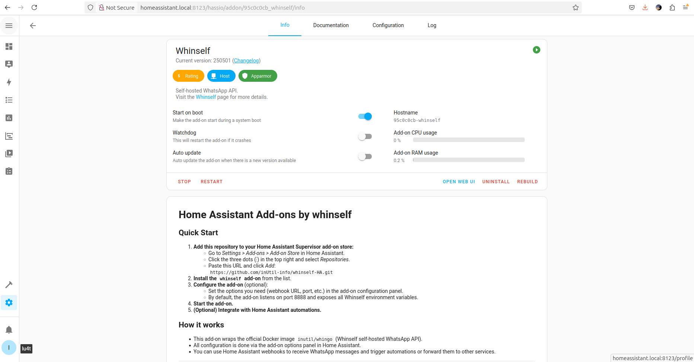

# Whinself Home Assistant Add-on

Self-hosted WhatsApp API for Home Assistant, powered by the official Whinself Docker image.

---

  

---

## About

Whinself is a Home Assistant add-on that provides a self-hosted WhatsApp API, enabling you to integrate WhatsApp messaging into your automations and workflows.  
This add-on wraps the official [Whinself API](https://whinself.app) and exposes it as a service within your Home Assistant instance.

- **Project Home:** [https://github.com/inUtil-info/whinself-HA](https://github.com/inUtil-info/whinself-HA)
- **Official Whinself Website:** [https://whinself.app](https://whinself.app)
- **Official Whinself Documentation:** [https://docs.whinself.app/docs/tutorials/quick-start](https://docs.whinself.app/docs/tutorials/quick-start)
- **Add-on Documentation:** See the "Documentation" tab in the add-on panel in Home Assistant.

---

## Support & Community

- For questions, suggestions, or issues, please use the [GitHub Issues](https://github.com/inUtil-info/whinself-HA/issues) page.
- For more information about Home Assistant add-ons, visit the [Home Assistant Community Add-ons](https://github.com/hassio-addons) project.

---

## Credits

- [inutil Labs](https://github.com/inUtil-info) for Whinself and the official Docker image.
- Inspired by the structure and best practices of the [Home Assistant Community Add-ons](https://github.com/hassio-addons) project.

---

## License

MIT License

---

For detailed setup, configuration, and usage, please refer to the documentation provided with the add-on and the official Whinself docs.
